```{r setup, echo=FALSE, warning=FALSE, error=FALSE, message=FALSE}

library(formattable)
library(htmltools)
library(dplyr)

# load table data, output from speeds.R
load("data/table_dat.RData")

```

# Introduction

The B3108 runs north of Winsley conurbation connecting Warminster Road in the West, with Bath Road in Bradford on Avon.

There have been on-going discussions regarding the speed limit on this road. This document aims to expand on some of the points mentioned in Briefing Note: "B3108 Winsley Bypass" published in November 2022.

-   That speeds are already on average in the same ballpark as proposed speed limits\
-   Cost implications of slower speeds on journey times are balanced out by other costs, such as collision costs, noise and benefits from adding infrastructure to enable car free trips. TAG guidance reflect more value than time for an employed person using the road.
-   That a significant number of people live along the road, with numerous properties fronting onto the road.

# Scenarios

The current speed limits along the road are shown in the figure below. 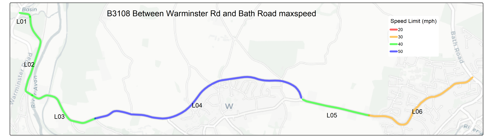

Given the complex nature of the road, with steep gradients, narrow, winding sections and proximity to residential areas there are numerous proposals. These have been broken down into scenarios

### Scenario A

Reducing the 50mph section to 40mph bringing it into line with adjoining roads

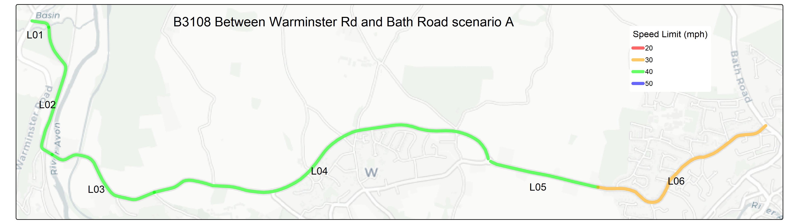

### Scenario B

Reducing the speed limit along the entire stretch of road to 30mph, bringing it into line with the Eastern most segment running through Bradford on Avon.

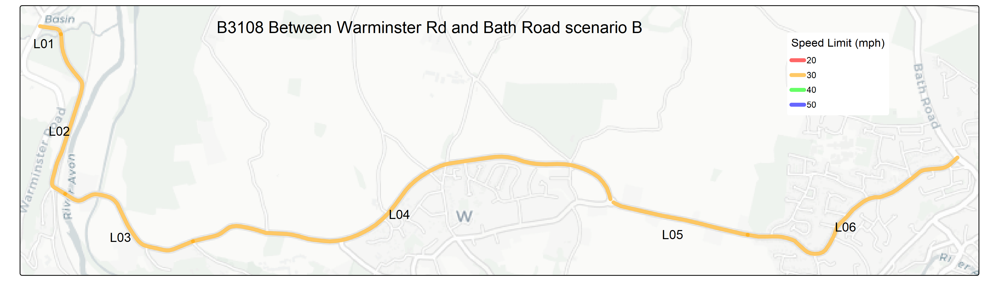

### Scenario C

30mph along the full stretch but 20mph in the most built up section through Bradford on Avon, bringing it into line with other urban areas in Wiltshire. 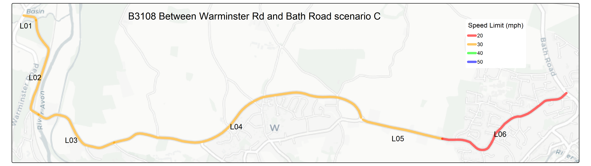

## Scenario D

20 mph along the full stretch, the most effective at reducing noise and collision risk. 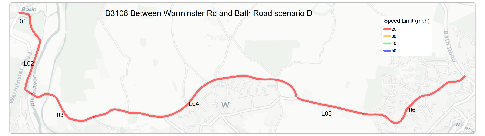

### Vision Zero

A 20 mph limit may appear extreme at first glance; however, Wiltshire Council has formally committed to the principles of Vision Zero, which aims to eliminate all deaths and serious injuries on the road network. At present, the county remains a considerable distance from this ambition, with 189 people Killed or Seriously injured on the regions roads in 2024. This suggests that more decisive and ambitious measures may be required.

Vision Zero is founded on the principle that if road users comply with the rules, the transport system should be designed so that fatal outcomes are not possible. Current vehicle safety standards (Euro NCAP crash tests) require vehicles to withstand a 64 kph (40 mph) impact with a rigid barrier. Any collision occurring at higher speeds exceeds this tested safety threshold.

On rural roads, head-on collisions are a common and particularly severe crash type (as evidenced in STATS19 data). In such cases, the equivalent impact speed is the combined speed of both vehicles. Two vehicles colliding head-on at 20 mph each produces an impact broadly equivalent to a single vehicle striking a solid object at 40 mph. Speeds above this therefore significantly increase the likelihood of fatal injury, even in modern vehicles.

## Population

It is estimated over 1400 people live within 100 metres of the B3108. 225 of these live within 100 metres of the 50mph section. 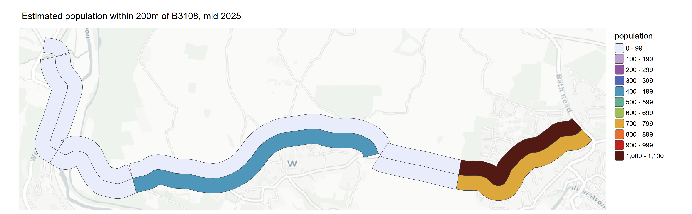

The Office for National Statistics (ONS) compiles regularly updated population data for the 'Local Super Output Areas' (LSOA). The plot below shows the total population for LSOA areas that intersect the B3108. 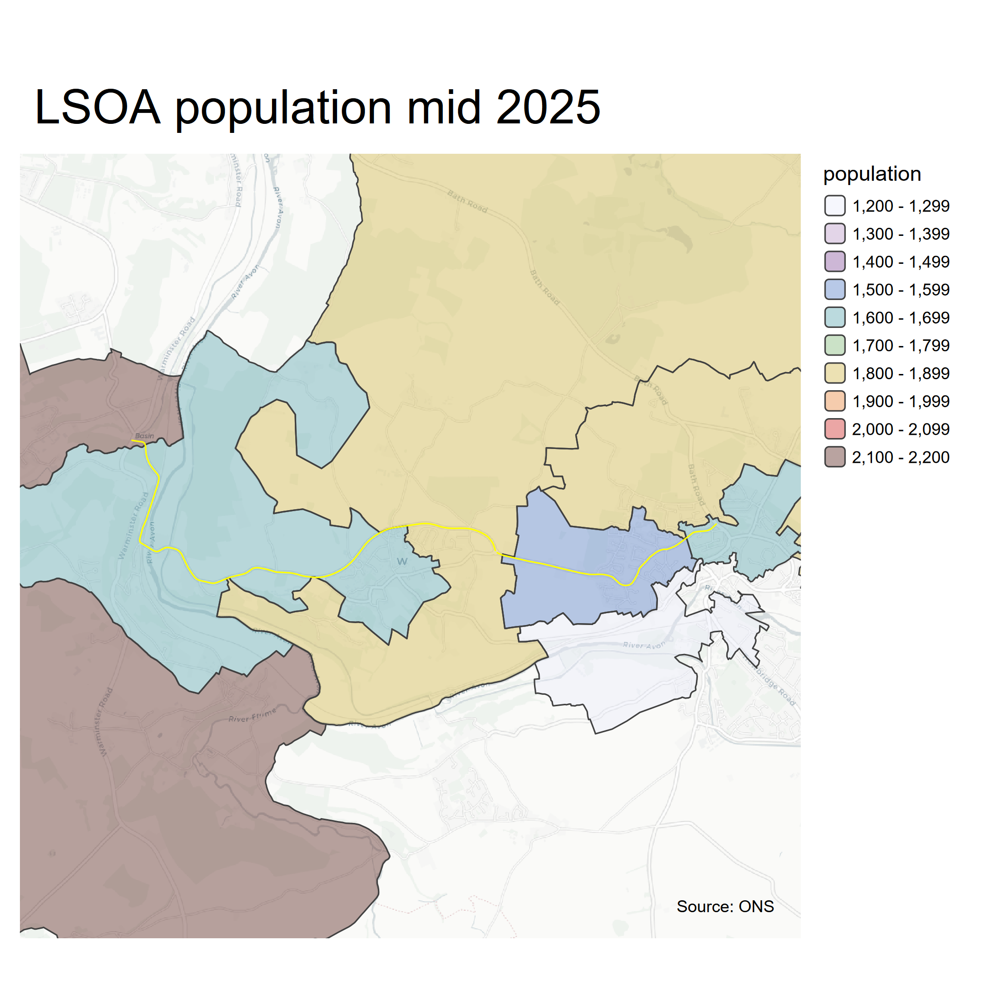 In order to estimate the population close to the road the population was distributed over the OSM buildings shapes based on the area of the buildings. The population of each building that falls within a 100m buffer of either side of the road was summed. It is estimated that just over 1400 people live within 100 metres of the B3108, the majority along Winsley Road in Bradford on Avon.

## Collision costs

Between 2010 and 2024 there were 57 collisions resulting in 74 casualties reported to the Police, these are plotted below: 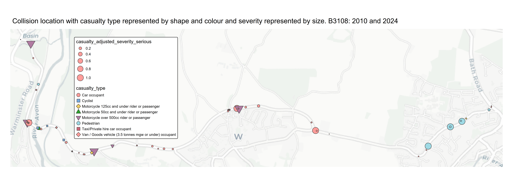 In Bradford on Avon it is mostly Pedestrians and along the bypass it is predominantly motorists and Winsley Hill Cyclists.

Applying the methodology from TAG to the collisions along B3108 and summing per link gives an estimate for the value of prevention per year. 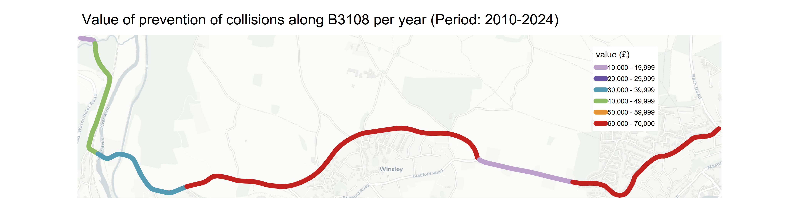 \## Cycle infrastructure benefits Narrowing the road could be achieved by adding high quality cycle and walking infrastructure to the road, such as the AI generated image below.  TAG table 4.1.6 provides a cost benefit for cycle infrastructure to the cyclist based on the time spent cycling the infrastructure.

Using the DfT estimate for cyclists using the road each day, it is estimated that the benefit for adding a segregated cycle path along the full length of the B3108, assuming a cyclist travels at 5 metres per second, could be quantified at over £30,000 per year to the 500+ cyclists who currently use the road every week. Adding this, along with a high quality footpath, could reduce the road width, also reduce the speed of vehicles down the road. It would also become an artery for active travel through the area.

One of the takeaways from the analysis of STATS19 data on drivers involved in collisions on the road is that they generally live locally. Enabling people to undertake local journeys on foot or by bicycle will reduce the number of motor vehicles on the road.

(map of LSOA of drivers)

## Noise
The calculation on noise is shown in the [noise tab](https://blaisekelly.github.io/B3108_speeds/noise.html).The noise level from the vehicle counts and classes were estimated and adjusted to the facade of each building. The biggest impact would be in Winsley village with reductions of on average 2.8dB (equivalent to halving of total sound energy).
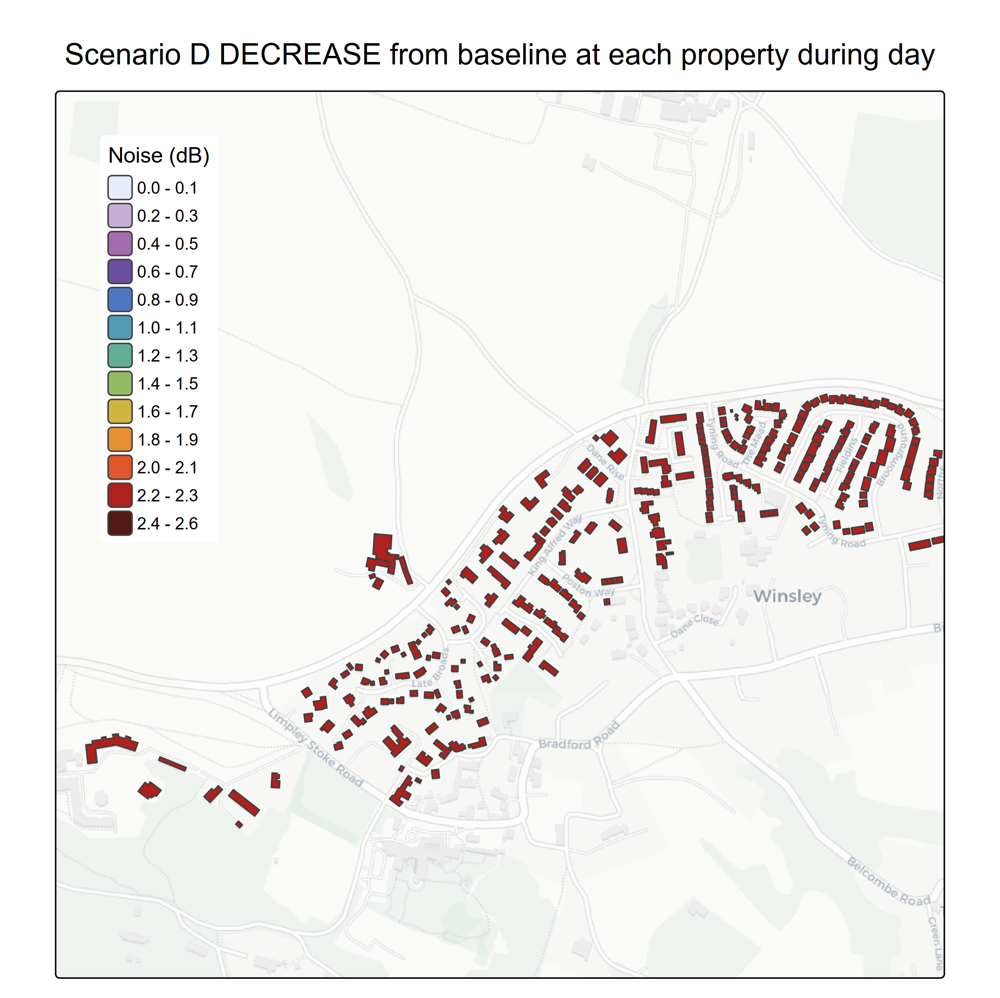
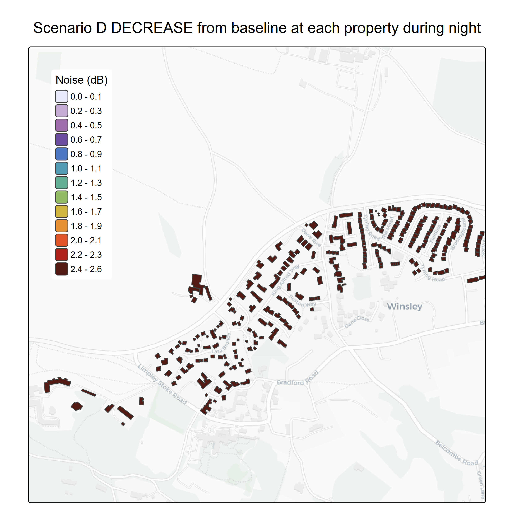


# Air pollution

The image below shows an example of NO~2~ drop off calculated with the [Defra NO~2~ drop off tool](https://laqm.defra.gov.uk/air-quality/air-quality-assessment/no2-falloff/). NO~2~ reacts with the atmosphere and drops off relatively quickly from the roadside. Even without any changes to the vehicle fleet or number of vehicles using the road, it is estimated that [increasing the source (vehicles) and receptor (buildings) distance by 2m NO~2~ would be 14% lower at the receptors](https://www.cibse.org/media/tw0bfknn/ukueq-white-paper-the-urban-emergency-main-page-v01.pdf) 

TAG sheet A3.3 Table A 3.2.2 Gives a damage cost value range based on incremental concentrations. Assuming a roadside NO~2~ concentration between 10ug/m3 and 40ug/m^3^ and taking the lower and upper monetary estimates the benefit of reducing roadside concentrations by 14% for the population living next to the road would be between £1,546 and £239,733 just for NO~2~.

```{r, echo=FALSE, warning=FALSE, error=FALSE, message=FALSE}

load("data/results.RData")

sa =  paste0("£", prettyNum(cost_df$`Scenario A`[6],big.mark = ","))
sb =  paste0("£", prettyNum(cost_df$`Scenario B`[6],big.mark = ","))
sc =  paste0("£", prettyNum(cost_df$`Scenario C`[6],big.mark = ","))
sd =  paste0("£", prettyNum(cost_df$`Scenario D`[6],big.mark = ","))

```

# Summary

-   Adding cycle path: £30,000\
-   Collision Avoidance: £245,205\
-   Reducing speed limit:
-   Scenario A: -£1,643\
-   Scenario B: -£661,576\
-   Scenario C: -£801,843\
-   Scenario D: -£4,087,308\
-   Noise reduction:
-   Scenario A: `r sa`\
-   Scenario B: `r sb`\
-   Scenario C: `r sc`\
-   Scenario D: `r sd`\
-   Air Pollution: £1,546 - £239,733

Assuming a 20mph speed limit along the entire road could eliminate the serious collisions (the majority of the collision cost), a 20mph limit could save people £245,205-£4,087,308+`r sd` = £3,104,886. Adding a cycle path could give cyclists a £30,000 benefit and increasing the source receptor distance with a fully segregated two way cycle path could save £239,733 in air pollution exposure costs, adding nearly £300,000 to the £3,104,886 net benefit to the area.
