```{r setup, echo=FALSE, warning=FALSE, error=FALSE, message=FALSE}

library(formattable)
library(htmltools)
library(dplyr)

# load table data, output from speeds.R
load("data/table_dat.RData")

```

## Typical speeds

In order to determine the typical speeds of vehicles travelling along the road the Google Distance API was used. This is a tool to estimate the journey time between two points for a future date based on historic data. Using the "best guess" parameters provides the most realistic single prediction available from the model by integrating real-time road conditions with historical patterns https://developers.google.com/maps/documentation/distance-matrix/distance-matrix. It returns the estimated time to travel this distance based on historic data. This has been compared against measured data and found to be a good representation of vehicle speed.

The road was split into 6 sections, based on the Open Street Map (OSM) segments, with some segments joined together to simplify the model and reduce the number of calls to the API. Described from West to East, Link 1 (L01) is the section of Lower Stoke Road that joins Warminster Road. The colour of each link is the mean speed in both directions as per the scale shown in L06 from the Google Distance Matrix API queries. Below each section plot is the speed profile split by direction.

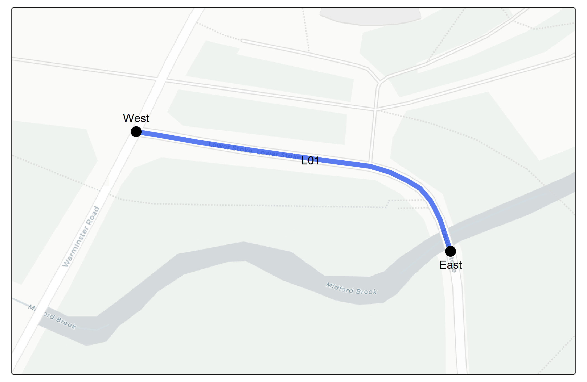 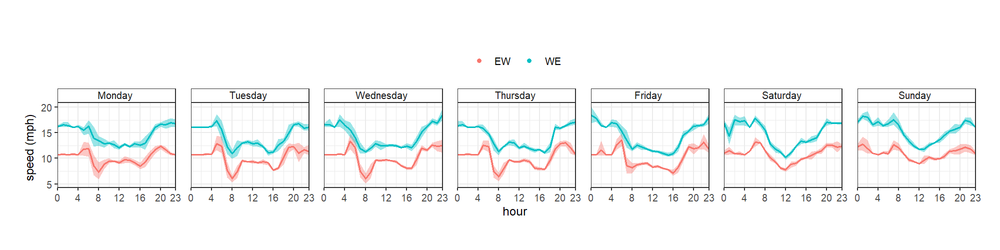

L02 is the section from Midford Brook bridge to the base of Winsley Hill. 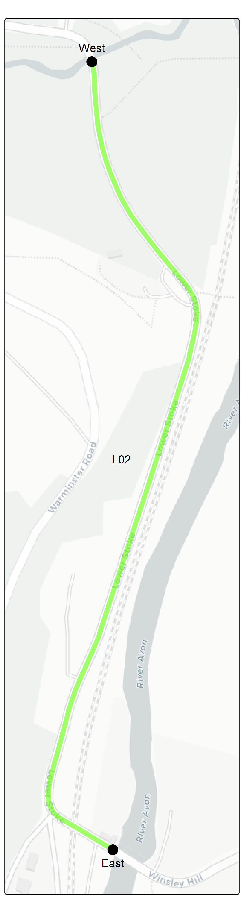 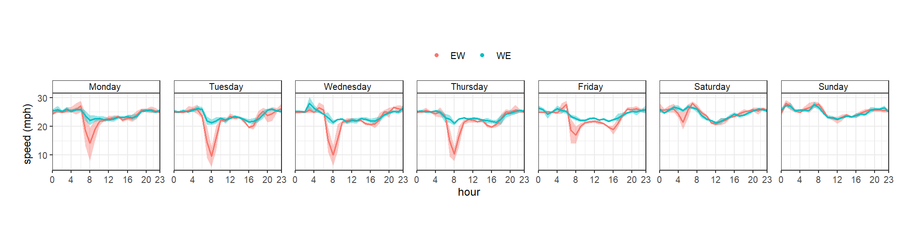

L03 is Winsley Hill up to where the speed limit currently changes to 50 mph, at the junction with Woodlands Drive. 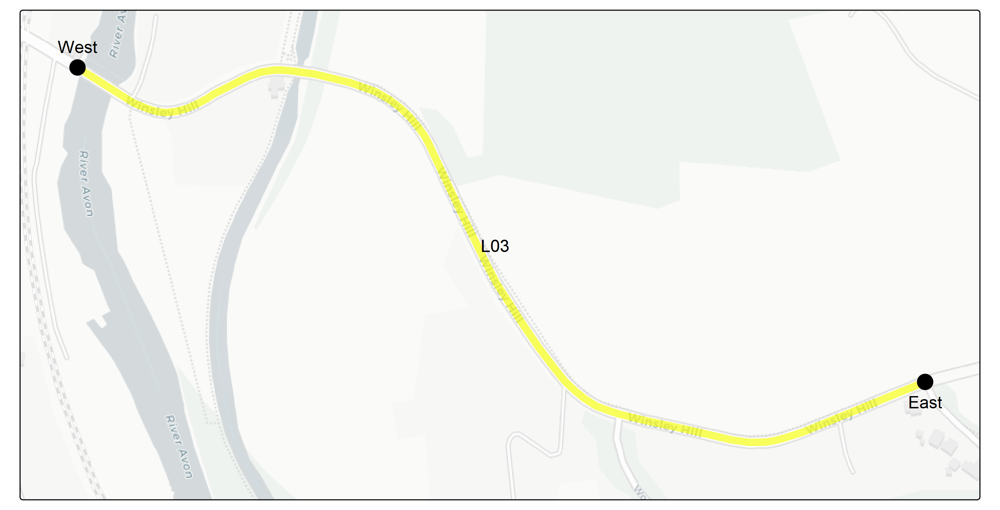 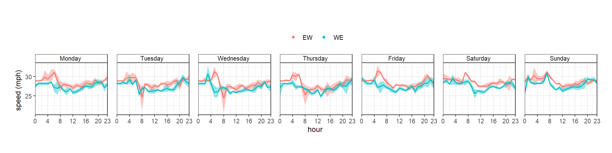

L04 is the 50mph section of the bypass, stretching all the way to the roundabout with Winsley and Bradford Roads. 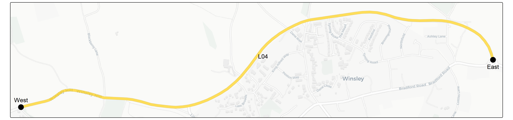 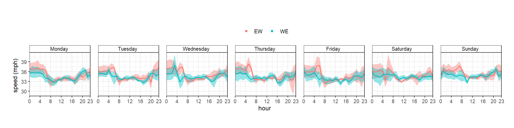 L05 is the 40 mph section of Winsley Road 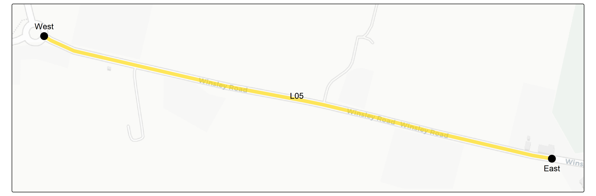 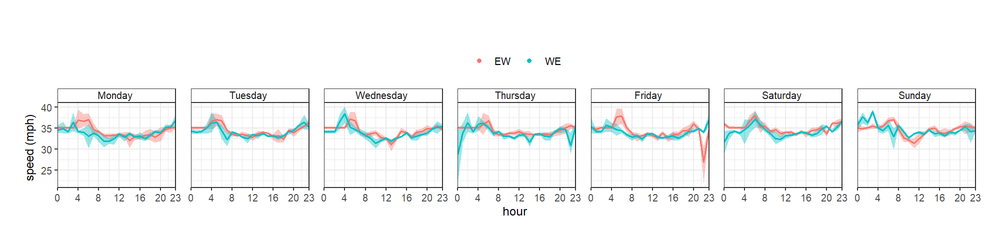 L06 is the 30mph section of Winsley Road. 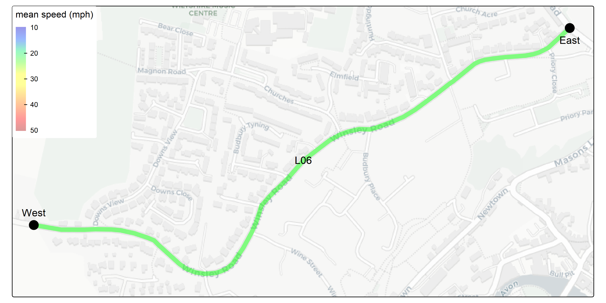 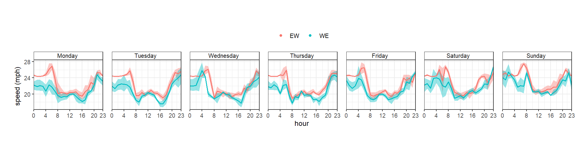

Each segment was queried for each hour of a future week, which was the week beginning 5th January 2026, in both directions for each of the 6 segments. This was 168 x 2 x 6 = 2,016 calls in total. Google provides 5,000 free calls per month, with further calls charged at 0.5 pence per call.

# Impact on journey time

Using the data from the Google API the impact on journey time along the stretch of road was assessed. This was done by taking the average speed for each hour, the length of each stretch of road and swapping the average speed for the revised speed limit. If the speed limit was lower than the average speed the journey time was recalculated with the speed limit assumed to be the speed.

The results of this for each scenario are shown in the table below for each direction 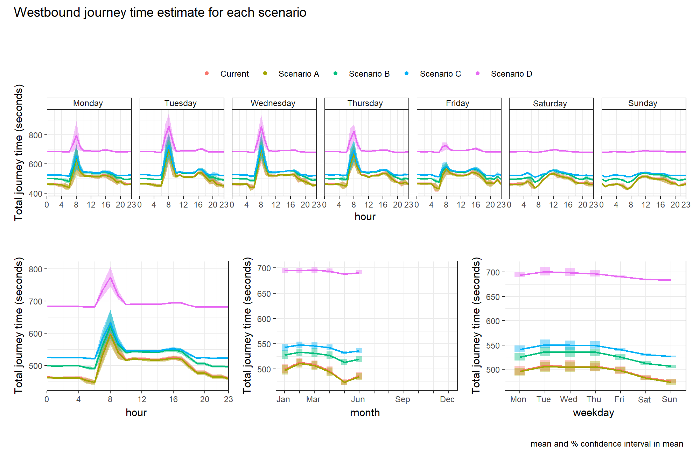 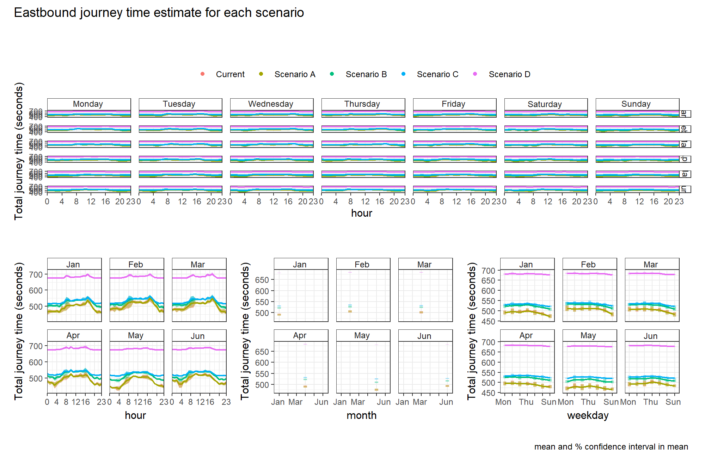

The current situation is not visible on the plot, because it is behind Scenario As line as it is identical (499 seconds Westbound and 490 Eastbound). Scenario B is estimated to have a 30 second increase in both directions, C 45 second increase Westbound and 40 seconds Eastbound and D 197 seconds increase Westbound and 191 Eastbound.

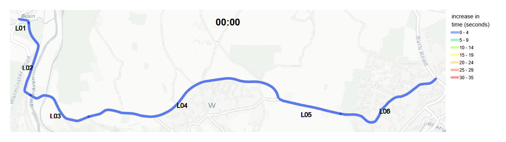 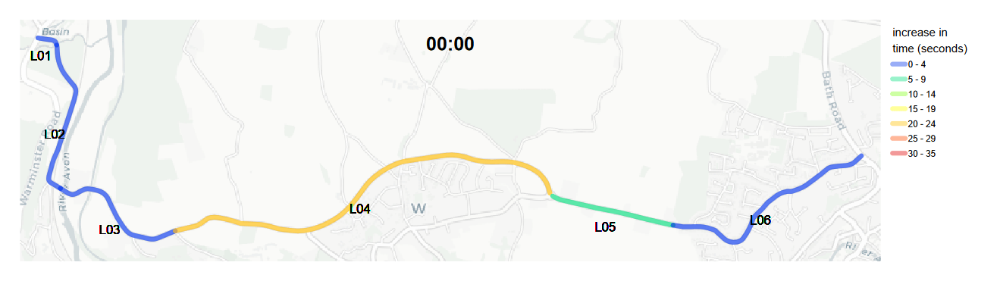 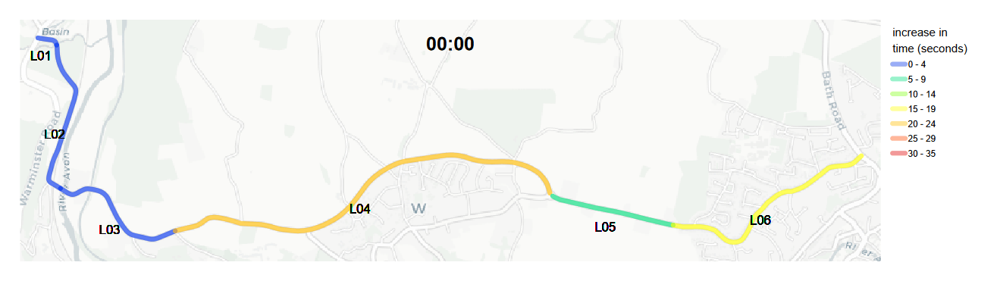 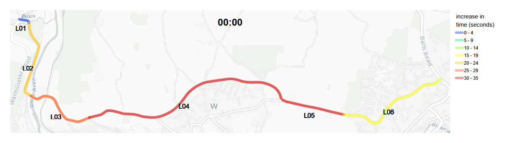

# Economic impact

The DfT uses TAG data to attribute value to decisions. There has been a lot of criticism of this approach, especially when it is

The market price of journey times is often mentioned. But it also includes: - Monetary valuation of changes in noise - Damage cost and marginal abatement cost values by pollutant - £ per tonne of CO~2~e emissions - Value of prevention per collision - Value of improving active travel infrastructure - Social impacts of public transport

## Trip data

The DfT last estimated the trips along the B3108 at Winsley Hill in 2019 (https://roadtraffic.dft.gov.uk/count-points/947637). Prior to this a manual count was undertaken each year for the last 10 years. The manual count data in 2018 provides a diurnal profile for each vehicle and direction. The directional data estimated in 2019 has been combined with the diurnal profile.

In 2024 it was estimated that Annual Average Daily Trips (AADT) [were similar to 2019](https://www.gov.uk/government/statistics/provisional-road-traffic-estimates-great-britain-october-2023-to-september-2024/provisional-road-traffic-estimates-great-britain-october-2023-to-september-2024). Therefore, 2019 traffic data has been used for this analysis.

On average 52% of vehicle traffic travels Eastbound. This reaches its peak at 6am when 74% of vehicles are travelling in this direction. At 5pm the majority (63%) of traffic flows in the Westbound direction. 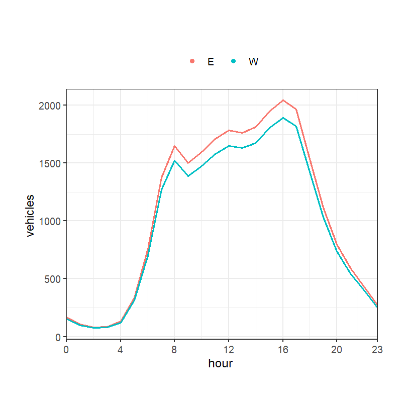

## Value of time
Delay costs were estimated following UK Department for Transport Transport Analysis Guidance (TAG) using the following approach:  

 -  Traffic Data: Annual Average Daily Traffic (AADT) by vehicle type and direction was obtained from DfT count point data for 2019. Hourly and daily traffic distributions were applied using TRA0307 data to estimate traffic volumes by hour, day of week, and  - direction.  
 -  Journey Purpose Allocation: Traffic was disaggregated by journey purpose (Work, Commuting, Other) using TAG Data Book Table A1.3.4, which provides the proportion of trips by purpose for different vehicle types and time periods.  
 -  Values of Time: TAG Data Book Tables A1.3.1-A1.3.5 were applied by vehicle type, journey purpose, and time period to calculate an hourly cost rate for traffic flows (£/hour).  
 -  Journey Time Analysis: Observed speeds from [data source] were used to calculate baseline journey times. Scenario journey times were calculated by capping speeds at scenario-specific limits and recalculating journey times for each road segment.  
 -  Delay Cost Calculation: For each hour and direction, delay (in seconds) was calculated as the difference between scenario and baseline journey times, converted to hours, and multiplied by the hourly traffic cost rate to estimate total delay costs.

 have been matched to trip data for the road, disaggregating each trip by estimated economic activity. This has been combined with the journey time estimates to provide a figure for the perceived loss to the economy

Calculating for each scenario by direction gives: 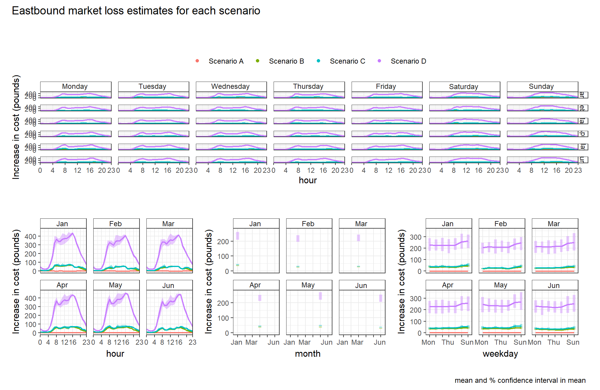 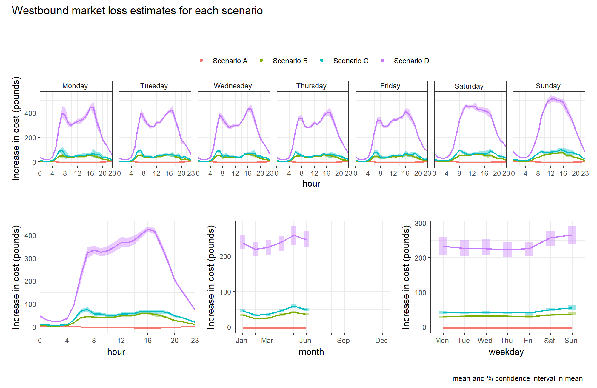

The TAG perceived loss to the market for each Scenario over the course of a year is:\
- A: £1,644\
- B: £661,576\
- C: £801,843\
- D: £4,087,308

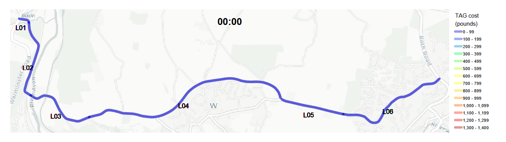   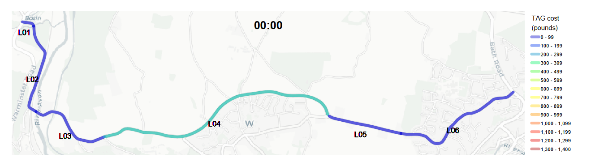

Evidence that uniform speed limits are less cognitively challenging

20mph is most efficient speed for electric vehicles, saving drivers money.

## Value of time

The tables A1.3.4 and A1.3.5 from [TAG data book](https://www.gov.uk/government/publications/tag-data-book) were imported and reshaped to give a timeseries for each hour of the day.

Table A1.3.4

There are two methods for calculating time, per vehicle or per person. TAG table A1.3.3 gives estimates for occupancies of vehicles for time ranges during the week and weekend averages. However, this can become complicated when deciding trip reason for car occupants. Table A1.3.4 is shown below, reshaped into a value for weekday or weekend for each hour for each vehicle type.

```{r, echo=FALSE, warning=FALSE, error=FALSE, message=FALSE}

TAG_A1.3.4_4$pc_trips = round(as.numeric(TAG_A1.3.4_4$pc_trips))

names(TAG_A1.3.4_4) = c("day", "hour", "direction", "vehicle","journey","% trips") 

ft1 = formattable(TAG_A1.3.4_4, list(
  area(col = c(`% trips`)) ~ normalize_bar("pink", 0.2),
  day = formatter("span",
                         style = day ~ style(color = ifelse(day == "weekday", "green", "red")))
))

# Wrap in scrollable div
div(style = "height: 400px; overflow-y: scroll;", 
    tags$style(HTML("
      .formattable_widget table thead th {
        position: sticky;
        top: 0;
        background-color: white;
        z-index: 10;
      }
    ")),
    as.htmlwidget(ft1))

```

Table A1.3.5 is shown below, reshaped into a value for weekday or weekend for each hour for each vehicle type.

```{r, echo=FALSE, warning=FALSE, error=FALSE, message=FALSE}

TAG_A1.3.5_3$costs = round(as.numeric(TAG_A1.3.5_3$costs),1)

names(TAG_A1.3.5_3) = c("day", "hour", "direction", "vehicle","journey","cost\n(£/hr)") 

TAG_A1.3.5_3 = filter(TAG_A1.3.5_3, !vehicle == "(Occupants)")

ft2 = formattable(TAG_A1.3.5_3, list(
  area(col = c(`cost\n(£/hr)`)) ~ normalize_bar("orange", 0.2),
  day = formatter("span",
                         style = day ~ style(color = ifelse(day == "weekday", "green", "red")))
)) 

# Wrap in scrollable div
div(style = "height: 400px; overflow-y: scroll;", 
    tags$style(HTML("
      .formattable_widget table thead th {
        position: sticky;
        top: 0;
        background-color: white;
        z-index: 10;
      }
    ")),
    as.htmlwidget(ft2))

```

These tables are joined to the DfT AADT data to give one table with flows split by trip purpose and assigned a cost.

```{r, echo=FALSE, warning=FALSE, error=FALSE, message=FALSE}


AADT_dd = AADT_diurnal_direction |> 
  filter(!is.na(costs)) |> 
  transmute(date,
            direction = direction_of_travel,
            TAG_mode = TAG_vehicle,
            journey,
            trips = round(purpose_count,1),
            `cost\n(£/hr)` = round(purpose_count*costs,1))


ft3 = formattable(AADT_dd, list(
  area(col = c(`cost\n(£/hr)`)) ~ normalize_bar("orange", 0.2),
  area(col = c(trips)) ~ normalize_bar("skyblue", 0.2)
)) 

# Wrap in scrollable div
div(style = "height: 400px; overflow-y: scroll;",
    tags$style(HTML("
      .formattable_widget table thead th {
        position: sticky;
        top: 0;
        background-color: white;
        z-index: 10;
      }
    ")),
    as.htmlwidget(ft3))

```
