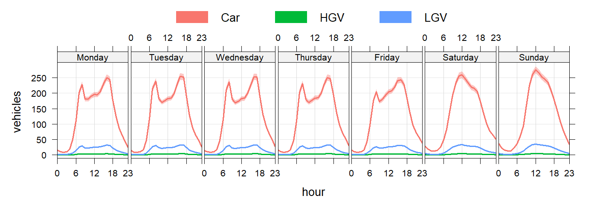
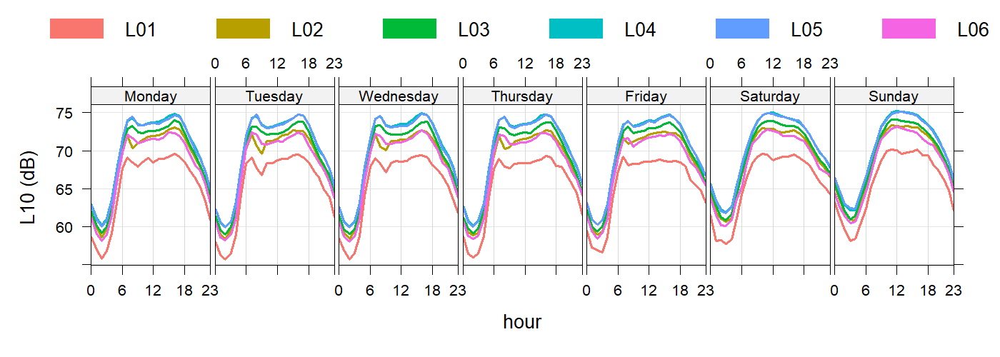

```{r setup, echo=FALSE, warning=FALSE, error=FALSE, message=FALSE}

library(formattable)
library(htmltools)
library(dplyr)

# load table data, output from speeds.R
load("data/table_dat.RData")
load("data/results.RData")

```

# Introduction

The noise level at each building for each hour of a typical week has been calculated using the [DfT AADT Count point 947637](https://storage.googleapis.com/dft-statistics/road-traffic/downloads/aadfbydirection/count_point_id/dft_aadfbydirection_count_point_id_947637.csv") along Winsley Hill, extrapolated with the typical diurnal profile using 946637 [TRA0307](https://assets.publishing.service.gov.uk/media/684965113a2aa5ba84d1dee2/tra0307-traffic-distribution-by-time-of-day.ods) which gives the profile below:



These flows were applied to the full length of the road.


The noise level calculation is a screening assessment to compare between scenarios and estimate the costs benefit to the population.

This calculation does not include:

- Ground absorption  
- Screening / barriers  
- Reflections  
- Façade corrections  
- Road gradient  
- Road surface correction


# Vehicle Noise
$A_i$ The vehicle-type–specific noise emission constant, referenced to a 10 m distance, taken from TAG / CRTN-based road traffic noise tables:
Car = 27.7
LGV = 34.7
HGV = 39.7
$$
E_{i,10} = N_i \cdot 10^{\frac{A_i + 10 \log_{10}(v_i)}{10}}
$$

where $N_i$ is the hourly traffic flow, $v_i$ is the mean speed (km h$^{-1}$), which was calculated from the google API for each hour of a typical week.

Summing up the outputs for each vehicle type:
$$
E_{10} = \sum_i E_{i,10}
$$
Gives the L10 values for each road segment.
$$
L_{10} = 10 \log_{10}(E_{10})
$$

The 10m roadside value is propagated to the building façade.
$$
L_{\text{build}} = L_{10} - 10 \log_{10}\left(\frac{r}{10}\right)
$$
The buildings included in this calculation and their distance are shown for each road segment in the figure below


where:

and $r$ is the horizontal distance from the road to the building façade (m). the from the road to the building (m).

And aggregating to assessment periods:
$$
L_{\mathrm{Aeq},P}
=
10 \log_{10}
\left(
\frac{1}{N_P}
\sum_{i=1}^{N_P}
10^{L_{\mathrm{Aeq},1h,i}/10}
\right)
$$

The scenarios are described in the section
The changes in noise for the main segments are shown below:

## L03: Winsley Hill daytime


Night time (23:00 to 07:00)


## L04: Winsley by-pass day time


Night time

## L06: Bradford on Avon day time


Night time


# Outputs
These changes werre summarised in change matricies as required by the TAG workbook and exported to a [google sheet](https://docs.google.com/spreadsheets/d/1ye5mGe87G8MOEXqLE1CDZjKf7IeSbZD_Zn87ZR_CpzE/edit?usp=sharing) which is linked to the [Noise Assessment Workbook](https://docs.google.com/spreadsheets/d/1ucvtuX5xq0Dq6FAKIRIEckvFTT6Pji7p90nkgnsfb7Y/edit?usp=sharing)

The number of houses affected are shown in the table below.
```{r, echo=FALSE, warning=FALSE, error=FALSE, message=FALSE}

library(formattable)

names(houses_df$...1) = "description"

ft = formattable(houses_df) 
ft


```

The estimated cost benefit from government TAG is shown in the table below.
```{r, echo=FALSE, warning=FALSE, error=FALSE, message=FALSE}

library(formattable)

ft = formattable(cost_df, list(
  area(col = c(`Scenario A`)) ~ normalize_bar("red", 0.2),
  area(col = c(`Scenario B`)) ~ normalize_bar("red", 0.2),
  area(col = c(`Scenario C`)) ~ normalize_bar("red", 0.2),
  area(col = c(`Scenario D`)) ~ normalize_bar("red", 0.2)
)) 
ft


```

